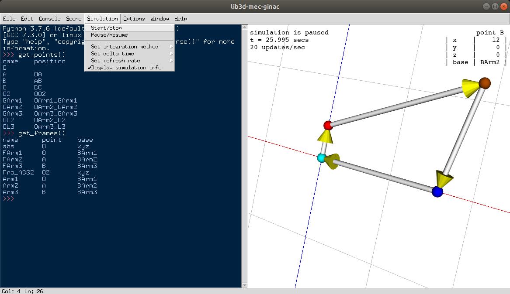
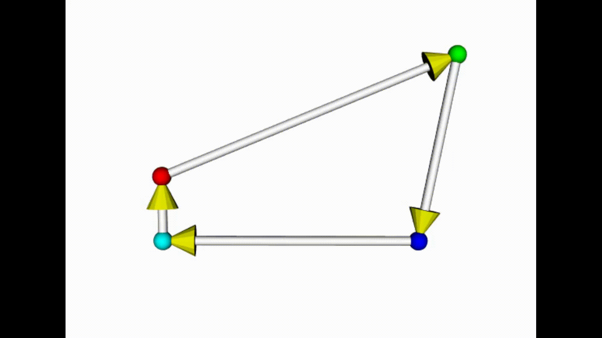

## Introduction

This package is an extension of the symbolical C++ library lib3d_mec_ginac for Python.

[lib3d_mec_ginac](http://www.imem.unavarra.es/3d_mec/download/lib3d-mec-ginac/eccomas2007_paper.pdf) provides all the features of a modern symbolic kernel (matrix algebra, expressions atomization, trigonometric simplifications, ...).
It is designed specifically to pose and solve equations in dynamical mechanical multibody systems.

pylib3d_mec_ginac brings all the features of this library to a high level interpreted language with a clean and easy to use API and a graphical user interface to visualize mechanical simulations.


## Installation

You will need python==3.7 and ubuntu OS ( 64-bit ). For the time being, only
ubuntu 18.04 system was tested succesfully. Later versions of ubuntu and python may also work.


You can use [this script](install.sh) to install this library and its dependencies in your system, or just run the next code in your bash console:

```bash
curl https://raw.githubusercontent.com/Vykstorm/pylib3d-mec-ginac/stable/install.sh | bash
```


## Usage

This software can be used in different ways.

#### As a python module

Import all the functions & classes of this library inside the python interpreter
and embed its features to your applications.

```bash
python
>>> from lib3d_mec_ginac import *
>>> ...
```

### As a framework

Use the integrated graphical user interface where you can build and simulate
mechanical systems within this library.
The interface includes an interactive console to run arbitrary python code
and a 3D viewer to display the mechanism.

The contextual menu provides options to change simulation parameters, open, edit
and run python files, customize the interface, among other things.

Execute the next statement to start using it:
```bash
python -m lib3d_mec_ginac
```




### Try it online

Finally you can run a jupyter notebook and use this library. No installation needed, but features are limited ( 3D viewer is not avaliable ).

[Try it now!](https://pylib3d-mec-ginac.herokuapp.com/notebooks/Untitled.ipynb)


## Documentation

Most of the classes and methods of the API are documented.
You can use the command ```help``` inside the Python interpreter to get information about them
e.g:
```python
from lib3d_mec_ginac import System
help(System)
```

Also [this page](https://pylib3d-mec-ginac-docs.herokuapp.com/) contains the reference of the API and a quick start tutorial.


## Examples


This library provides a few usage examples under the directory [examples/](examples/)
Here we list a few of them

#### Four bar linkage



Go to the directory where you downloaded this
repository and run this example with:
```
python -m lib3d_mec_ginac examples/four_bar
```


#### Simple pendulum


Go to the directory where you downloaded this repository and run this example with:
```
python -m lib3d_mec_ginac example/simple_pendulum
```


## License

This project is under [GPLv2 license](LICENSE.txt)
