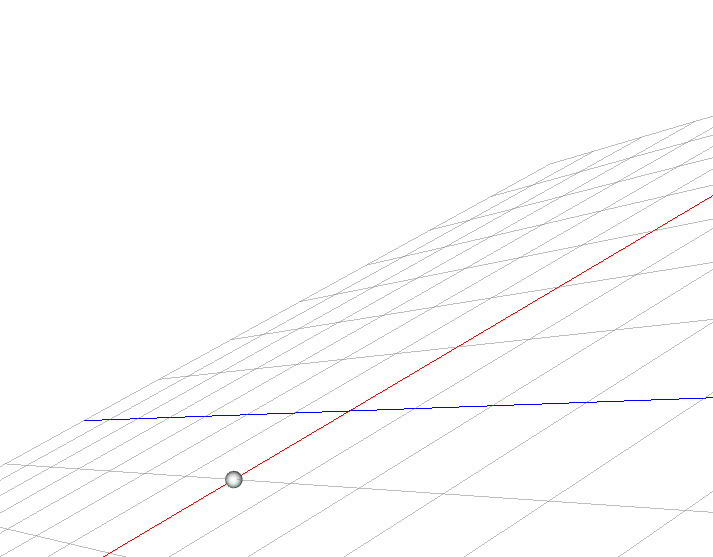
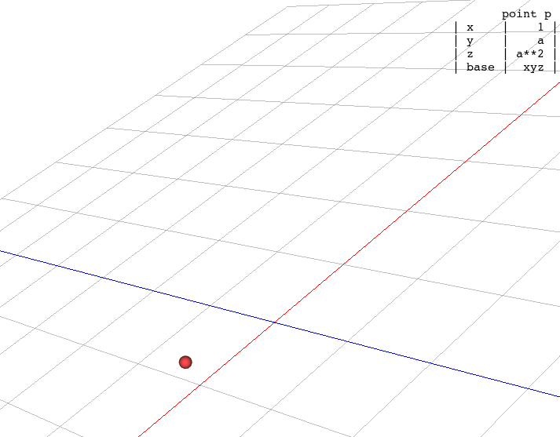
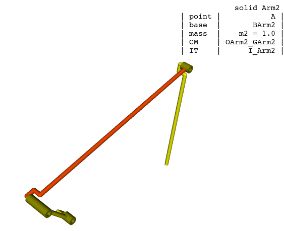

Design & implementation notes
-----------------------------------

Arithmetic operations between primitives
=============================

There are a few geometric primitives that can be operated mathematically,
like vectors and tensor objects. Arithmetic operations can be clasified in
two groups:

- Unary operations which has only one operand. The only operation of this type
  supported is the negation function, and is implemented by symbols, matrices,
  expressions and wrenches.
  The result of this operation is always of the same kind as
  the object negated. For example, negating a vector will always return another
  vector instance.

- Binary operations take instead two input values. Such values can be of the same
  kind or different. The arithmetic operations supported by the library
  are the sum, product, subtraction, division and power.
  The avaliability of such operations and their results depends entirely on the operand types as
  the table shown below demonstrates.

Sum & subtract operation ( each cell represents the result of the operation for each input argument pair):

+--------+--------+--------+------+--------+--------+--------+--------+
| +/-    | number | symbol | expr | matrix | vector | tensor | wrench |
+--------+--------+--------+------+--------+--------+--------+--------+
| number | number | expr   | expr | ---    | ---    | ---    | ---    |
+--------+--------+--------+------+--------+--------+--------+--------+
| symbol | expr   | expr   | expr | ---    | ---    | ---    | ---    |
+--------+--------+--------+------+--------+--------+--------+--------+
| expr   | expr   | expr   | expr | ---    | ---    | ---    | ---    |
+--------+--------+--------+------+--------+--------+--------+--------+
| matrix | ---    | ---    | ---  | matrix | ---    | ---    | ---    |
+--------+--------+--------+------+--------+--------+--------+--------+
| vector | ---    | ---    | ---  | ---    | vector | ---    | ---    |
+--------+--------+--------+------+--------+--------+--------+--------+
| tensor | ---    | ---    | ---  | ---    | ---    | tensor | ---    |
+--------+--------+--------+------+--------+--------+--------+--------+
| wrench | ---    | ---    | ---  | ---    | ---    | ---    | wrench |
+--------+--------+--------+------+--------+--------+--------+--------+

Product:

+--------+--------+--------+--------+--------+--------+--------+--------+
| x      | number | symbol | expr   | matrix | vector | tensor | wrench |
+--------+--------+--------+--------+--------+--------+--------+--------+
| number | number | expr   | expr   | matrix | vector | tensor | wrench |
+--------+--------+--------+--------+--------+--------+--------+--------+
| symbol | expr   | expr   | expr   | matrix | vector | tensor | wrench |
+--------+--------+--------+--------+--------+--------+--------+--------+
| expr   | expr   | expr   | expr   | matrix | vector | tensor | wrench |
+--------+--------+--------+--------+--------+--------+--------+--------+
| matrix | matrix | matrix | matrix | matrix | ---    | ---    | ---    |
+--------+--------+--------+--------+--------+--------+--------+--------+
| vector | vector | vector | vector | ---    | expr   | ---    | ---    |
+--------+--------+--------+--------+--------+--------+--------+--------+
| tensor | tensor | tensor | tensor | ---    | vector | tensor | ---    |
+--------+--------+--------+--------+--------+--------+--------+--------+
| wrench | wrench | wrench | wrench | ---    | ---    | ---    | wrench |
+--------+--------+--------+--------+--------+--------+--------+--------+

.. note::

    - The multiplication between two vectors represents the dot product
    - The multiplication between two matrices represent the matrix product
      operation ( The python symbol for this operation is usually ``@`` but in this library
      is ``*`` to match the C++ regular operator symbols )

Division ( first column indicates the left operand ):

+--------+--------+--------+--------+
| /      | number | symbol | expr   |
+--------+--------+--------+--------+
| number | number | expr   | expr   |
+--------+--------+--------+--------+
| symbol | expr   | expr   | expr   |
+--------+--------+--------+--------+
| expr   | expr   | expr   | expr   |
+--------+--------+--------+--------+
| matrix | matrix | matrix | matrix |
+--------+--------+--------+--------+
| vector | vector | vector | vector |
+--------+--------+--------+--------+
| tensor | tensor | tensor | tensor |
+--------+--------+--------+--------+
| wrench | wrench | wrench | wrench |
+--------+--------+--------+--------+

Power operation where the first column represents the base operand:

+--------+--------+--------+------+
| ^      | number | symbol | expr |
+--------+--------+--------+------+
| number | number | expr   | expr |
+--------+--------+--------+------+
| symbol | expr   | expr   | expr |
+--------+--------+--------+------+
| expr   | expr   | expr   | expr |
+--------+--------+--------+------+

The library provides an implementation for all of this arithmetic operations
by adding metamethods to the classes SymbolNumeric, Expr, Matrix, Vector, Tensor and Wrench.
A metamethod in Python acts in a similar way than the overloading operators feature in
C++.

For example, the method ``Expr.__add__`` will be invoked whenever an addition operation is performed
and the left operand is an expression.

Evaluation of symbolic expressions & matrices
=============================

The classes Expr and Matrix can be used to represent symbolic expressions or matrices
( where elements are expressions ).

Instances of both classes can be evaluated with the ``evaluate`` function exposed
in the API. The result of the evaluation is a floating number ( when passing an
expression ) or a numpy array of floats ( for matrices ) with the same shape::

    >>> a = new_param('a')
    >>> q = a ** 2 + a + 1
    >>> a.value = 2
    >>> evaluate(q)
    6.0
    >>> m = Matrix([ q, q ** 2 ])
    >>> evaluate(m)
    [ 6.0, 36.0 ]

The steps taken to evaluate the matrix ``m`` above are the next:

1. The elements of the matrix are optimized ( atomized ) by calling
   ``matrix_list_optimize``. In this case, ``m`` could look like this::

        >>> matrix_list_optimize(m)
        >>> m
        [ atom1, atom1 ** 2 ]
        # where atom1 = a ** 2 + a + 1

2. A numeric function is built for the input matrix internally.
   It can also be obtained by calling ``compile_numeric_function(m)``

   Such function takes as arguments the symbols values and performs a substituion process
   in the elements of ``m``. The output is the numerical evaluation of each
   formula shipped as a numpy array of floating numbers.

   Such function could be defined as a Python routine like this internally::

         def numeric_func(a):
              atom1 = a ** 2 + a + 1
              return np.array([ atom1, atom1 ** 2 ])

3. ``evaluate`` invokes the compilled numeric function with a=2 ( the current numeric
   value of the symbol ``a`` in the system)

.. note::

    For optimization purposes, numerical function arguments are packed as numpy arrays
    by symbol types. The function defined above could look like this::

        def numeric_func(params):
            atom1 = params[0] ** 2 + params[0] + 1
            return np.array([ atom1, atom1 ** 2 ])
    In this case ``params[0]`` will be the first parameter defined within the system,
    which is ``a``

The evaluation of a single expression object is performed in the same way.
The only difference is that ``evaluate`` returns only a float number instead of a numpy array.

.. note::

    ``evaluate(q)`` is equivalent to ``evaluate(Matrix([q]))[0]``

How geometric primitives are rendered on the screen
=============================

There are different primitives like vectors, points or frames which can be
used to build the mechanical system. Those objects can be drawn to the screen
using the methods defined in the class ``Scene`` with the prefix ``draw_``

An example::
    >>> a = new_param('a')
    >>> v = new_vector('v', 1, a, a ** 2)
    >>> p = new_point('p', v)
    >>> drawing = draw_point(p)

The code above draws the point ``p`` defined with the vector ``v`` ( it has the
origin point as the previous point )

This is what happens behind the scenes:

- An instance of the class PointDrawing is instantiated. Its a subclass of
  Drawing3D. This object represents an entity that can be displayed in the screen.

- An affine transformation matrix is computed for the entity in order to translate,
  rotate & scale the drawing to render it correctly.

- The drawing is added to the scene by calling the method ``Scene.add_drawing``.
  By doing this, the graphics are refreshed in the 3D viewer.

The affine transformation of the drawing is represented by a symbolic matrix with
size 4x4. Affine transformations can be concatenated using the matrix product
operation. One can apply scale, rotation & translation in the 3D space.

In the specific case of a point drawing, we only need to apply a translation operation.
For the last example, the symbolic matrix must be this::

    >>> drawing.transform
    ╭               ╮
    │ 1  0  0     1 │
    │ 0  1  0     a │
    │ 0  0  1  a**2 │
    │ 0  0  0     1 │
    ╰               ╯

Finally, when a new graphics refresh request is sent to the 3D viewer, each drawing
evaluates numerically his affine transformation matrix with the symbol values of the
default system and send the result to the underline graphics library::

    >>> sys = get_default_system()
    >>> a.value = 0.25
    >>> drawing.transform.evaluate( sys )
    array([[1.    , 0.    , 0.    , 1.    ],
           [0.    , 1.    , 0.    , 0.25  ],
           [0.    , 0.    , 1.    , 0.0625],
           [0.    , 0.    , 0.    , 1.    ]])

For a more complex affine transformation, take a look at the four bar linkage mechanism.
The drawing associated to the solid "Arm2" has the next transformation matrix::

    ╭                                                                                                                       ╮
    │  cos(theta2)*cos(theta1)-sin(theta1)*sin(theta2)  0  sin(theta2)*cos(theta1)+cos(theta2)*sin(theta1)   l1*cos(theta1) │
    │                                                0  1                                                0                0 │
    │ -sin(theta2)*cos(theta1)-cos(theta2)*sin(theta1)  0  cos(theta2)*cos(theta1)-sin(theta1)*sin(theta2)  -l1*sin(theta1) │
    │                                                0  0                                                0                1 │
    ╰                                                                                                                       ╯

Which is a concatenation of two transformations: a rotation followed by a translation
( the order in which matrices are concatenated is the reverse of the order in which the
transformatins are applied )::

    ╭                          ╮
    │ 1  0  0   cos(theta1)*l1 │
    │ 0  1  0                0 │
    │ 0  0  1  -l1*sin(theta1) │
    │ 0  0  0                1 │
    ╰                          ╯
            x
    ╭                                                                                                         ╮
    │  cos(theta1)*cos(theta2)-sin(theta1)*sin(theta2)  0  sin(theta1)*cos(theta2)+cos(theta1)*sin(theta2)  0 │
    │                                                0  1                                                0  0 │
    │ -sin(theta1)*cos(theta2)-cos(theta1)*sin(theta2)  0  cos(theta1)*cos(theta2)-sin(theta1)*sin(theta2)  0 │
    │                                                0  0                                                0  1 │
    ╰
                                                                                                      ╯

